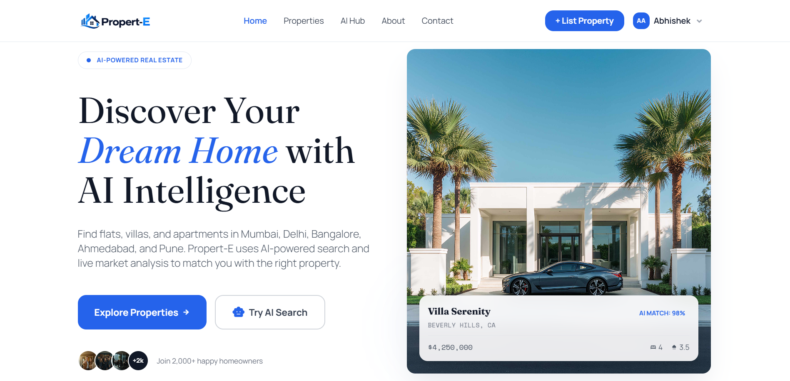
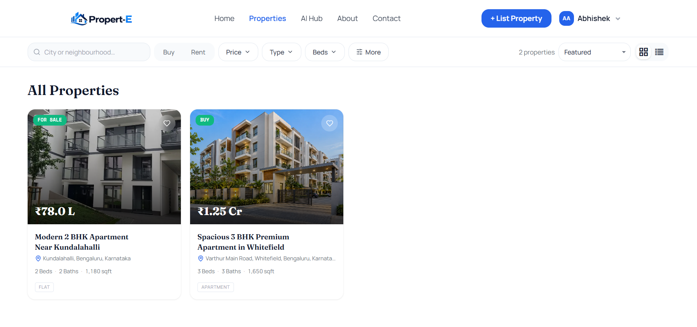
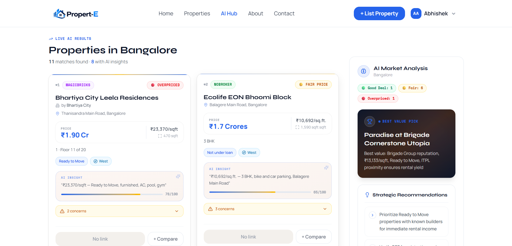
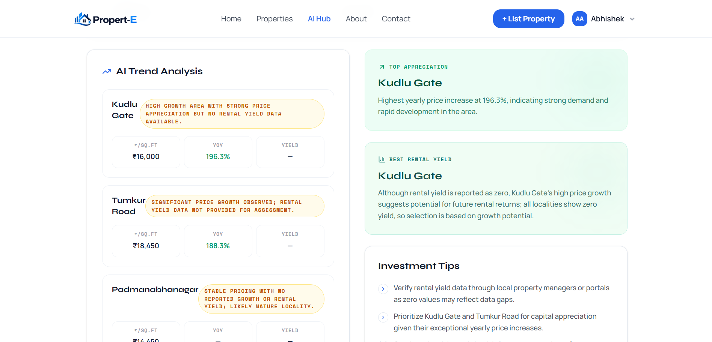
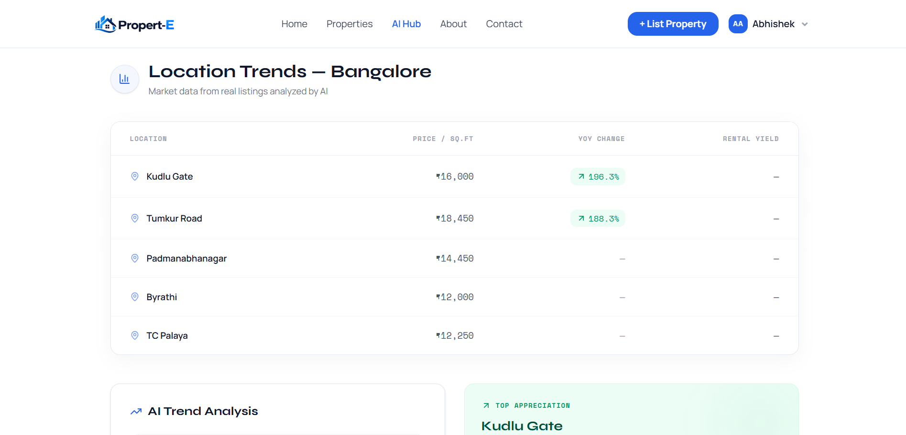
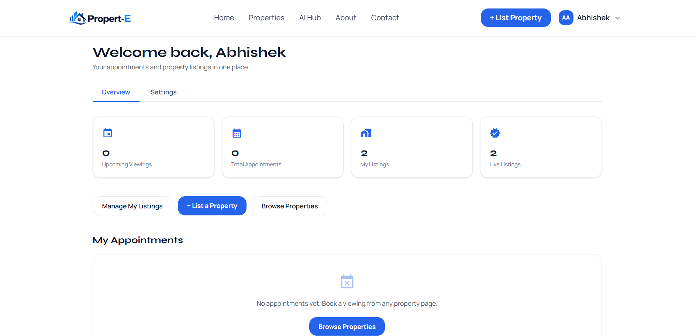
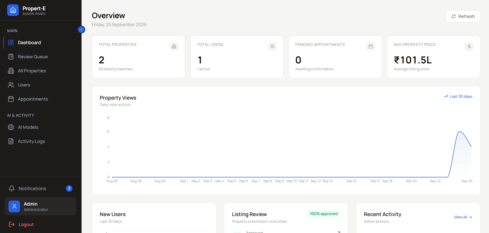
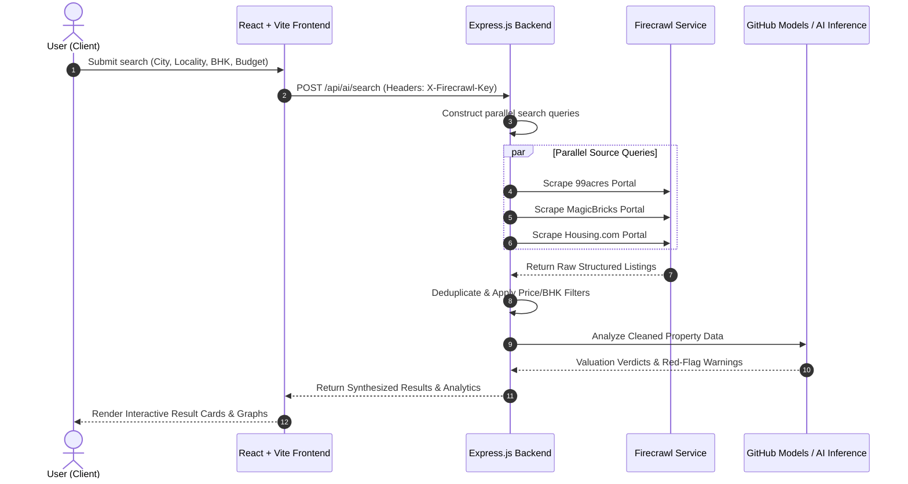
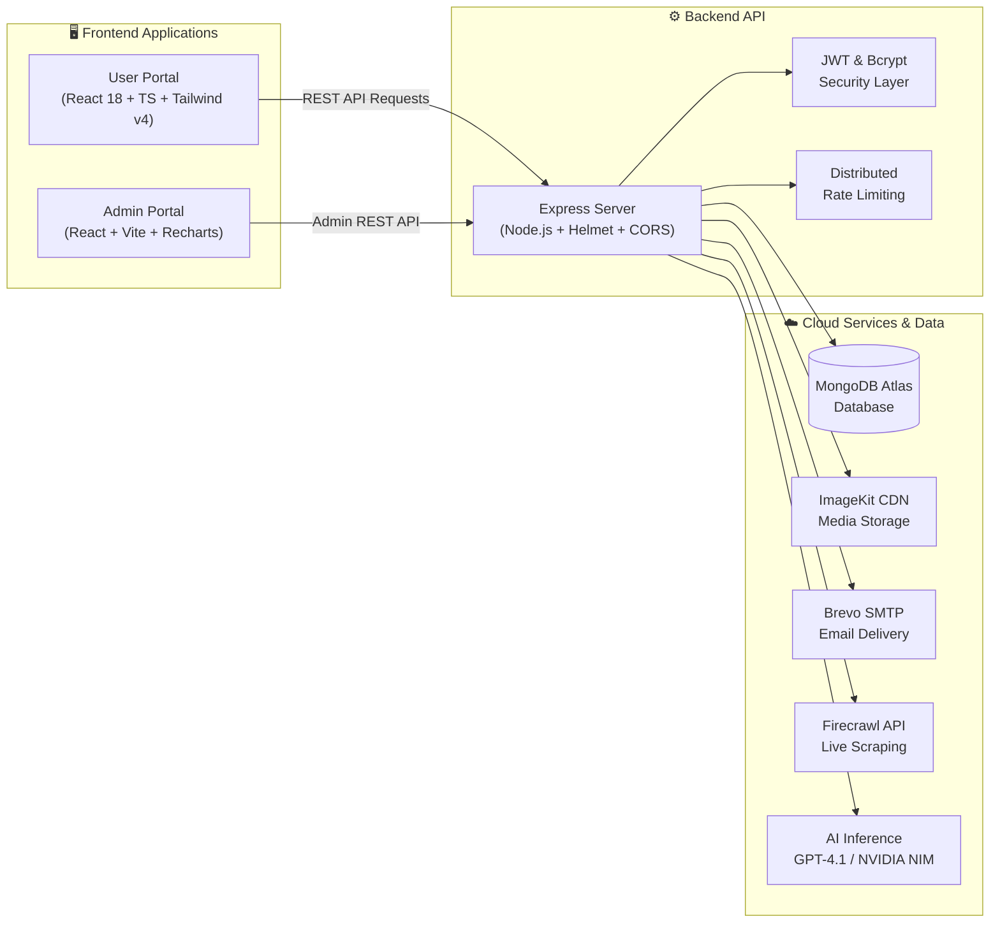

<div align="center">


<br/>


<br/><br/>

[](https://git.io/typing-svg)

<br/>

<p align="center">
  <b>Propert-E</b> is a modern, full-stack real estate platform engineered for seamless property discovery, listing management, viewing appointments, and intelligent market analysis across 30+ Indian metropolitan areas.
</p>

<p align="center">
  <a href="#-key-features">Features</a> •
  <a href="#-platform-previews">Previews</a> •
  <a href="#-architecture">Architecture</a> •
  <a href="#-tech-stack">Tech Stack</a> •
  <a href="#-quick-start">Quick Start</a> •
  <a href="#-api-endpoints">API Docs</a> •
  <a href="#-author">Author</a>
</p>

<br/>

<!-- Tech Badges -->
[](https://react.dev)
[](https://www.typescriptlang.org)
[](https://vitejs.dev)
[](https://tailwindcss.com)
[](https://nodejs.org)
[](https://expressjs.com)
[](https://www.mongodb.com)

<br/>

<!-- Repo Status Badges -->
[](https://github.com/abhishekachar05/Real-Estate-Website)
[](https://github.com/abhishekachar05/Real-Estate-Website/fork)
[](LICENSE)
[](https://github.com/abhishekachar05/Real-Estate-Website/issues)

</div>

<hr/>

## 🌟 Highlights & Overview

Propert-E bridges the gap between conventional real estate marketplaces and intelligent data aggregation. Users can discover verified properties, list residential and commercial units, book instant viewing visits, and leverage an **AI Property Hub** that queries and synthesizes live market listings with valuation verdicts and risk indicators.

```
┌─────────────────────────────────────────────────────────────────────────────┐
│                                PROPERT-E                                    │
│  ┌──────────────────────┬──────────────────────┬─────────────────────────┐  │
│  │   🏠 User Portal     │  🤖 AI Property Hub  │   📊 Admin Dashboard    │  │
│  │  • Browse & Filter   │  • Multi-Source Scan │  • Listing Review Queue │  │
│  │  • Multi-Photo CDN   │  • Valuation Verdict │  • Appointments & CRM   │  │
│  │  • Direct Booking    │  • Locality Trends   │  • User Management      │  │
│  │  • User Listing & Edit│ • Risk Warnings     │  • Analytics & Charts   │  │
│  └──────────────────────┴──────────────────────┴─────────────────────────┘  │
└─────────────────────────────────────────────────────────────────────────────┘
```

---

## 📸 Platform Previews

<div align="center">

### 🏡 Homepage Experience


<br/><br/>

### 🔍 Properties Directory & Filters


<br/><br/>

### 🤖 AI Property Hub & Market Insights


<br/><br/>

<table width="100%">
  <tr>
    <td width="50%" align="center">
      <b>📈 AI Market Trends</b><br/><br/>
      
    </td>
    <td width="50%" align="center">
      <b>📍 Locality Price Analysis</b><br/><br/>
      
    </td>
  </tr>
  <tr>
    <td width="50%" align="center">
      <b>👤 User Dashboard</b><br/><br/>
      
    </td>
    <td width="50%" align="center">
      <b>⚙️ Admin Management Portal</b><br/><br/>
      
    </td>
  </tr>
</table>

</div>

---

## ✨ Key Features

### 1. 🤖 Intelligent AI Property Hub
- **Multi-Source Scraping**: Collects live listings across major Indian property portals in real time using Firecrawl API.
- **Locality Precision**: Refined search focusing on micro-markets (e.g., *Indiranagar, Powai, Gachibowli*).
- **AI Investment Verdicts**: Generates valuation ratings, price-per-sq.ft comparisons, and potential red flags (RERA compliance, connectivity).
- **Client-Side Key Support**: Users can provide their own Firecrawl API keys with secure localStorage persistence.

### 2. 🏠 Property Management & Discovery
- **Comprehensive Filtering**: Filter by City, Property Type (Flat, Villa, Plot, Commercial), Budget Range, BHK, and Amenities.
- **Listing Lifecycle**: Registered users can publish properties, manage photo uploads, edit live details, and track approval status.
- **Instant Viewing Scheduling**: Intuitive appointment calendar supporting guest bookings and authenticated account synchronisation.
- **Cloud Media Pipeline**: ImageKit integration for fast, responsive multi-image CDN delivery.

### 3. 🛡️ Admin Dashboard & Governance
- **Listing Review Queue**: Quality control portal to approve, modify, or reject user-submitted properties.
- **Appointment CRM**: Manage viewing requests, assign meeting links, and update visit stages.
- **User Administration**: Account status controls (active, suspended, banned) with activity logs.
- **Visual Analytics**: Interactive performance graphs built with Recharts.

---

## 🏗️ Architecture

### 🔄 Multi-Source AI Search Pipeline



### 🧩 System Component Overview



---

## 💻 Tech Stack

| Domain | Technologies |
| :--- | :--- |
| **Frontend** | React 18, TypeScript, Vite 6, Tailwind CSS v4, Framer Motion, Lucide Icons, Sonner |
| **Admin Panel** | React, Vite, Tailwind CSS, Recharts, Lucide Icons |
| **Backend API** | Node.js (v18+), Express.js, Mongoose ODM, Multer, Helmet, CORS, Winston Logger |
| **Database** | MongoDB Atlas |
| **Media & CDN** | ImageKit.io API |
| **AI & Scraping** | Firecrawl API, GitHub Models (GPT-4.1), NVIDIA NIM |
| **Email Delivery** | Nodemailer with Brevo SMTP |

---

## 🚀 Quick Start

### 📋 Prerequisites
- **Node.js**: `v18.0.0` or later ([Download](https://nodejs.org/))
- **npm**: `v8.0.0` or later
- **MongoDB Atlas** account (or local MongoDB)

---

### 1️⃣ Clone the Repository

```bash
git clone https://github.com/abhishekachar05/Real-Estate-Website.git
cd Real-Estate-Website
```

---

### 2️⃣ Backend Setup

```bash
cd backend
npm install
cp .env.example .env
```

Configure your `backend/.env` file:

```env
# Server
PORT=4000
NODE_ENV=development
WEBSITE_URL=http://localhost:5173
FRONTEND_URL=http://localhost:5173
ADMIN_URL=http://localhost:5174

# Database & Auth
MONGO_URI=mongodb+srv://<username>:<password>@cluster.mongodb.net/propert-e?retryWrites=true&w=majority
JWT_SECRET=your_jwt_secret_key_minimum_32_characters
ADMIN_EMAIL=admin@propert-e.com
ADMIN_PASSWORD=your_secure_admin_password

# Image Uploads (ImageKit)
IMAGEKIT_PUBLIC_KEY=your_imagekit_public_key
IMAGEKIT_PRIVATE_KEY=your_imagekit_private_key
IMAGEKIT_URL_ENDPOINT=https://ik.imagekit.io/your_id

# Email (Brevo SMTP)
SMTP_USER=your_brevo_smtp_login
SMTP_PASS=your_brevo_smtp_password
EMAIL=noreply@propert-e.com
```

Start the backend server:

```bash
npm run dev
# Running on http://localhost:4000
```

---

### 3️⃣ Frontend Setup

```bash
cd ../frontend
npm install
cp .env.example .env
```

Configure `frontend/.env`:

```env
VITE_API_BASE_URL=http://localhost:4000
VITE_ENABLE_AI_HUB=true
```

Start the frontend application:

```bash
npm run dev
# Running on http://localhost:5173
```

---

### 4️⃣ Admin Dashboard Setup

```bash
cd ../admin
npm install
cp .env.example .env
```

Configure `admin/.env`:

```env
VITE_BACKEND_URL=http://localhost:4000
```

Start the admin dashboard:

```bash
npm run dev
# Running on http://localhost:5174
```

---

## 🔌 API Endpoints

<details>
<summary><b>🔐 Authentication & User Endpoints</b></summary>

| Method | Route | Description | Auth |
| :--- | :--- | :--- | :---: |
| `POST` | `/api/users/register` | Register a new user | No |
| `POST` | `/api/users/login` | Log in user and receive JWT | No |
| `POST` | `/api/users/admin` | Admin dashboard authentication | No |
| `GET` | `/api/users/me` | Fetch authenticated user profile | Bearer JWT |
| `POST` | `/api/users/forgot` | Trigger password reset email | No |
| `POST` | `/api/users/reset/:token` | Complete password reset | No |

</details>

<details>
<summary><b>🏠 Property Endpoints</b></summary>

| Method | Route | Description | Auth |
| :--- | :--- | :--- | :---: |
| `GET` | `/api/products/list` | Retrieve all verified public listings | No |
| `GET` | `/api/products/single/:id` | Get details for a single property | No |
| `POST` | `/api/user/properties` | Submit a property listing (Pending review) | User JWT |
| `GET` | `/api/user/properties` | Get listings published by logged-in user | User JWT |
| `GET` | `/api/user/properties/:id` | Get single listing for editing | User JWT |
| `PUT` | `/api/user/properties/:id` | Update an existing user listing | User JWT |
| `DELETE` | `/api/user/properties/:id` | Delete user listing | User JWT |

</details>

<details>
<summary><b>📅 Appointment Endpoints</b></summary>

| Method | Route | Description | Auth |
| :--- | :--- | :--- | :---: |
| `POST` | `/api/appointments/schedule` | Schedule a property viewing (Guest) | No |
| `POST` | `/api/appointments/schedule/auth`| Schedule a viewing (Logged-in user) | User JWT |
| `GET` | `/api/appointments/user` | Fetch appointments by email | No / JWT |
| `PUT` | `/api/appointments/cancel/:id` | Cancel scheduled appointment | User JWT |
| `GET` | `/api/appointments/all` | View all appointments | Admin JWT |
| `PUT` | `/api/appointments/status` | Update appointment status | Admin JWT |

</details>

<details>
<summary><b>🤖 AI & Analytics Endpoints</b></summary>

| Method | Route | Description | Auth |
| :--- | :--- | :--- | :---: |
| `POST` | `/api/ai/search` | Execute multi-source AI property search | Optional Key |
| `GET` | `/api/locations/:city/trends` | Fetch locality price & yield trends | Optional Key |
| `POST` | `/api/ai/validate-keys` | Verify Firecrawl key validity | No |
| `GET` | `/api/ai/localities` | Locality autocomplete suggestions | No |

</details>

---

## 📂 Repository Structure

```text
Real-Estate-Website/
├── frontend/                  # React 18 + TypeScript user application
│   ├── src/
│   │   ├── components/        # Reusable UI & section components
│   │   ├── contexts/          # Auth and global application state
│   │   ├── pages/             # Route views (lazy-loaded)
│   │   ├── services/          # Axios API clients & interceptors
│   │   └── styles/            # Theme tokens & Tailwind stylesheets
│   └── package.json
├── backend/                   # Express.js REST API server
│   ├── config/                # MongoDB, ImageKit, and Nodemailer configs
│   ├── controller/            # Request handlers & logic
│   ├── middleware/            # Auth, rate-limiting, and error handlers
│   ├── models/                # Mongoose database schemas
│   ├── routes/                # Express API routes
│   ├── services/              # AI inference & Firecrawl integration
│   └── server.js              # Server entry point
├── admin/                     # Admin moderation & analytics panel
│   ├── src/
│   │   ├── components/        # Admin UI, sidebar, charts
│   │   └── pages/             # Review queue, appointments, analytics
│   └── package.json
└── Image/                     # Documentation screenshots & previews
```

---

## 🤝 Contributing

Contributions, issues, and feature requests are welcome!

1. Fork the Project (`https://github.com/abhishekachar05/Real-Estate-Website/fork`)
2. Create your Feature Branch (`git checkout -b feature/AmazingFeature`)
3. Commit your Changes (`git commit -m 'Add some AmazingFeature'`)
4. Push to the Branch (`git push origin feature/AmazingFeature`)
5. Open a Pull Request

---

## 📝 License

This project is licensed under the MIT License — see the [LICENSE](LICENSE) file for details.

---

## 👨‍💻 Author

<div align="center">


### Abhishek Achar

[](https://github.com/abhishekachar05)
[](https://www.linkedin.com/in/abhishek-achar-9531b132b/)
[](https://portfolio-liart-eight-yieyezx2v3.vercel.app/)
[](mailto:abhishekachar0005@gmail.com)

<br/>

If you find this project useful, consider giving it a ⭐ star!

[](https://github.com/abhishekachar05/Real-Estate-Website)

<br/>


</div>
